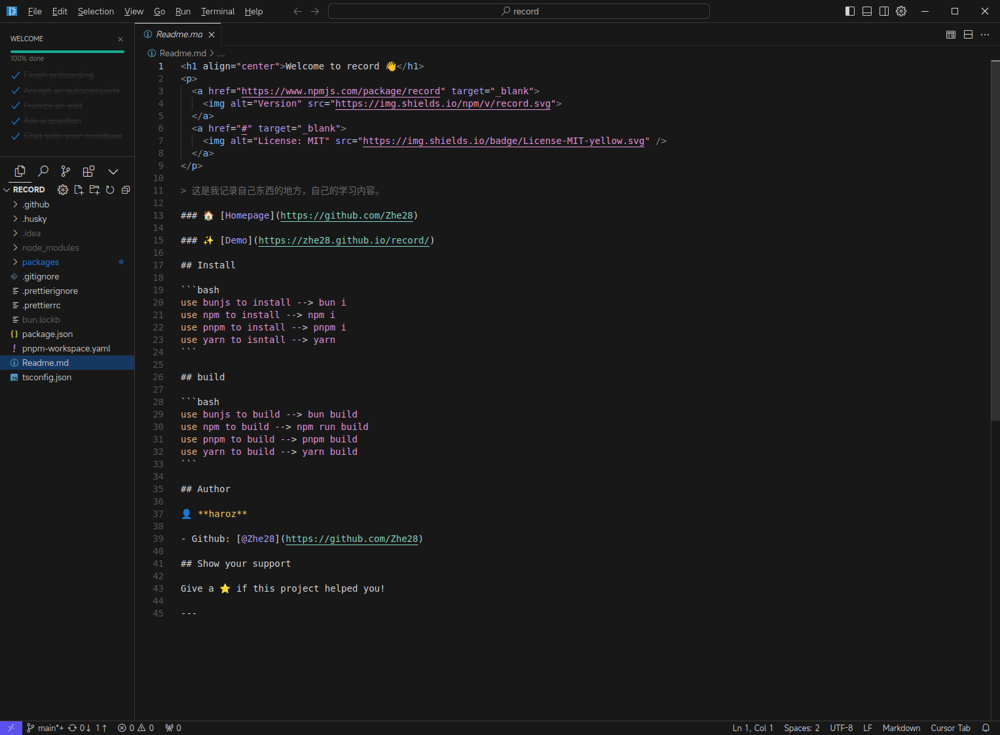

# Cursor.AppImage 命令行打开显示报错

在今天的时候,突然发现有这个错误

```shell
hz@hz-Jiaolong16K-Series-GM6BGEQ:~/Desktop$ bash -c ./cursor-0.41.2-build-240921llnho65ov-x86_64.AppImage

[92479:0929/202540.894936:FATAL:setuid_sandbox_host.cc(158)] The SUID sandbox helper binary was found, but is not configured correctly. Rather than run without sandboxing I'm aborting now. You need to make sure that /tmp/.mount_cursortRIW2u/chrome-sandbox is owned by root and has mode 4755.
追踪或断点陷阱 (核心已转储)
```

带着这个疑问, 就去问了 GPT, 但是他告诉我是 `AppImage 的沙盒化功能没有正确配置`

chrome-sandbox 是一个必要的文件，它负责创建一个沙盒环境来运行 AppImage 应用。但是，问题表明 /tmp/.mount_cursortRIW2u/chrome-sandbox 的所有权和模式不正确，这导致了 SUID sandbox helper binary 沙盒化功能的失败。要解决这个问题，你需要执行以下命令：

```shell
sudo chown root:root /tmp/.mount_cursortRIW2u/chrome-sandbox
sudo chmod 4755 /tmp/.mount_cursortRIW2u/chrome-sandbox
```

他说的挺有道理, 但是打眼一看这个 shell 命令, 这不是扯蛋么, 很明显的 随即生成的文件夹, 这么做肯定是不行的.

所以 GPT 不靠谱, 就自己在网上找了, 确实是 sandbox 的问题. 找了一圈之后就有了方案, 添加一个 `--no-sandbox` 参数.

为了后面使用方便, 我自己弄了个别名.

```shell
alias cursor="~/software/cursor/cursor.appimage --no-sandbox"
```

结果如下, 成了!


