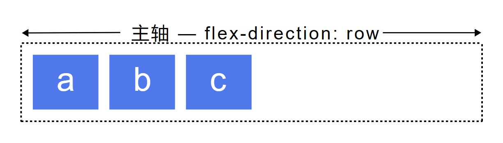
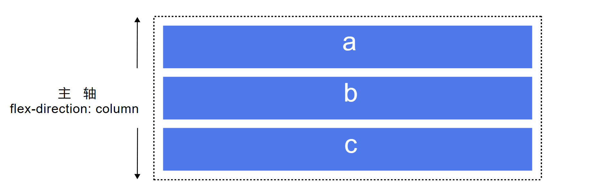
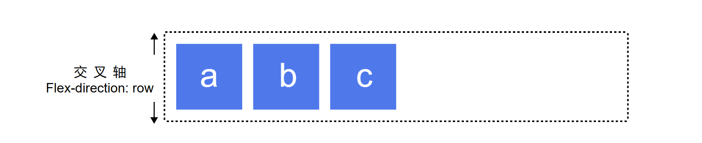
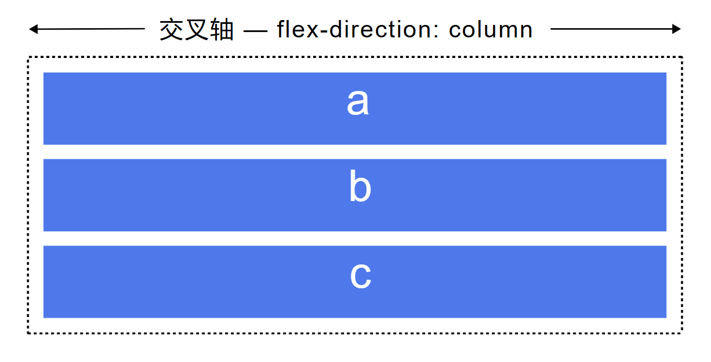

> reference [flexbox](https://developer.mozilla.org/zh-CN/docs/Web/CSS/CSS_Flexible_Box_Layout/Basic_Concepts_of_Flexbox)

## 介绍

Flexible Box 模型，通常被称为 flexbox，是一种一维的布局模型。它给 flexbox 的子元素之间提供了强大的空间分布和对齐能力。本文给出了 flexbox 的主要特性，更多的细节将在别的文档中探索。

我们说 flexbox 是一种一维的布局，是因为一个 flexbox 一次只能处理一个维度上的元素布局，一行或者一列。作为对比的是另外一个二维布局 CSS Grid Layout，可以同时处理行和列上的布局。

## flex 轴线

当使用 flex 布局时，首先想到的是两根轴线 — 主轴和交叉轴。

主轴由 flex-direction 定义，另一根轴垂直于它。我们使用 flexbox 的所有属性都跟这两根轴线有关，所以有必要在一开始首先理解它。

### 主轴

主轴由 flex-direction 定义，它有四个值

- row
- row-reverse
- column
- column-reverse

如果你选择了 row 或者 row-reverse，你的主轴将沿着行向延伸。

选择 column 或者 column-reverse 时，你的主轴会沿着页面的上下方向延伸——也就是块向。

### 交叉轴

交叉轴垂直于主轴，所以如果你的flex-direction（主轴）设成了 row 或者 row-reverse 的话，交叉轴的方向就是沿着上下方向延伸的。

如果主轴方向设成了 column 或者 column-reverse，交叉轴就是水平方向。

## flex-flow

flex-flow 属性是 flex-direction 和 flex-wrap 的简写形式。

### flex-direction

flex-direction 属性决定主轴的方向（即项目的排列方向）。

- row（默认值）：主轴为水平方向，起点在左端。
- row-reverse：主轴为水平方向，起点在右端。
- column：主轴为垂直方向，起点在上沿。
- column-reverse：主轴为垂直方向，起点在下沿。

### flex-wrap

flex-wrap 属性定义，如果一条轴线排不下，如何换行。

- nowrap（默认）：flex 的元素被摆放到到一行，这可能导致 flex 容器溢出。cross-start 会根据 flex-direction 的值等价于 start 或 before。为该属性的默认值。
- wrap：flex 元素 被打断到多个行中。cross-start 会根据 flex-direction 的值等价于 start 或before。cross-end 为确定的 cross-start 的另一端。
- wrap-reverse：和 wrap 的行为一样，但是 cross-start 和 cross-end 互换。

## flex 元素上的属性

为了更好地控制 flex 元素，有三个属性可以作用于它们：

- flex-grow
- flex-shrink
- flex-basis

### flex-grow

flex-grow 属性定义项目的放大比例，负值无效，默认为 0，即如果存在剩余空间，也不放大。

剩余空间是 flex 容器的大小减去所有 flex 项的大小加起来的大小。如果所有的兄弟项目都有相同的 flex-grow 系数，那么所有的项目将剩余空间按相同比例分配，否则将根据不同的 flex-grow 定义的比例进行分配。

### flex-shrink

CSS flex-shrink 属性指定了 flex 元素的收缩规则。flex 元素仅在默认宽度之和大于容器的时候才会发生收缩，其收缩的大小是依据 flex-shrink 的值。

flex-grow属性是处理 flex 元素在主轴上增加空间的问题，相反flex-shrink属性是处理 flex 元素收缩的问题。

如果我们的容器中没有足够排列 flex 元素的空间，那么可以把 flex 元素flex-shrink属性设置为正整数来缩小它所占空间到flex-basis以下。

与flex-grow属性一样，可以赋予不同的值来控制 flex 元素收缩的程度——给flex-shrink属性赋予更大的数值可以比赋予小数值的同级元素收缩程度更大。

### flex-basis

flex-basis 属性定义了在分配多余空间之前，项目占据的主轴空间（main size）。浏览器根据这个属性，计算主轴是否有多余空间。它的默认值为 auto，即项目的本来大小。

它可以设为跟 width 或 height 属性一样的值（比如 350px），则项目将占据固定空间。

### flex

flex 属性是 flex-grow, flex-shrink 和 flex-basis 的简写，默认值为 0 1 auto。后两个属性可选。

### order

order 属性定义项目的排列顺序。数值越小，排列越靠前，默认为 0。

## 元素间的对齐和空间分配

Flexbox 的一个关键特性是能够设置 flex 元素沿主轴方向和交叉轴方向的对齐方式，以及它们之间的空间分配。

### align-item

align-items 属性可以使元素在交叉轴方向对齐。

- flex-start：元素向交叉轴起点对齐。
- flex-end：元素向交叉轴终点对齐。
- center：元素向交叉轴中点对齐。
- baseline：元素的第一行文字的基线对齐。
- stretch（默认值）：如果项目未设置高度或设为 auto，将占满整个容器的高度。

### justify-content

justify-content 属性可以使元素在主轴方向对齐。

- flex-start：元素向主轴起点对齐。
