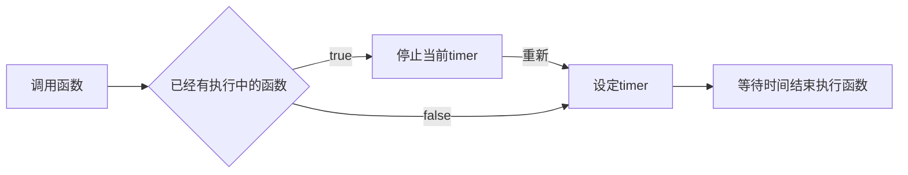
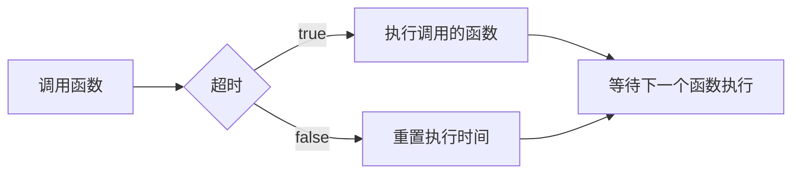
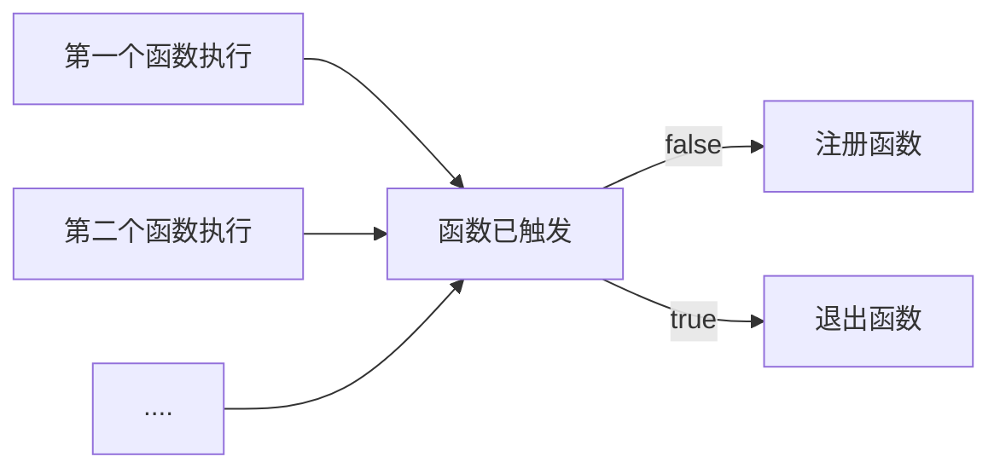
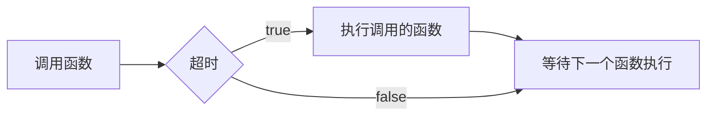

# 防抖和节流

## 防抖 Debounce

> 来源: https://juejin.cn/post/7057135245513981989

主要流程也不是太复杂，由于 js 函数 setTimeout 在执行前未执行的话能够被主动取消，这是执行的关键。

防抖其实挺简单的，就是在某个时间段内防止多次点击。防抖分为两种 `延迟debounce` 和 `前缘debounce`

连续的高频操作只会触发一次事件，延迟是在高频事件解释后触发，前缘是在高频事件开始时触发。

## 延迟debounce

#### 流程简图



### 具体代码如下所示

<b> 这是作为外部测试的函数 </b>

```typescript
// ./log.ts
export function log(message: string) {
  return function () {
    console.log(message);
  };
}
```

<b> 主要实现的函数 </b>

```typescript
// ./debounce.ts
import { log } from "./log.ts";

let timer: undefined | number = undefined;

function debounce(fn: Function, waitTime: number) {
  if (timer) {
    // 若存在正在发生的事件，清除定时重置变量
    clearTimeout(timer);
    timer = undefined;
  }
  timer = setTimeout(fn, waitTime);
}

debounce(log("debounce"), 5000);

setTimeout(() => {
  console.log(`the debounce has reset!`);
  debounce(test, 5000);
}, 3000);
```

## 前缘debounce

#### 流程简图



具体代码

```typescript
// ./debounce.ts
let timer: { fn: null | Function; delay: number; registerTime: number } = {
  fn: null,
  delay: 0,
  registerTime: 0
};

function debounce(fn: Function, delay: number) {
  // 检测是否已经有检查注册时间.
  if (Date.now() - timer.delay < timer.registerTime) {
    //   没超过有效时间重置注册时间
    timer = { fn, delay, registerTime: Date.now() };
    return;
  }
  //   未执行过函数,则直接执行函数并且注册相关内容
  fn();
  timer = { fn, delay, registerTime: Date.now() };
}

debounce(log("debounce1"), 5000);
debounce(log("debounce2"), 5000);

setTimeout(() => debounce(log("debounce3"), 5000), 5500);
```

## 节流 Throttle

throttle（节流），节流的策略是，固定周期内，只执行一次动作，若有新事件触发，不执行。周期结束后，又有事件触发，开始新的周期。节流策略也分前缘和延迟两种。与 debounce 类似，延迟是指 周期结束后执行动作，前缘是指执行动作后再开始周期。

两者的相同点是：<b> 在持续的时间内重复触发函数，防抖时间会重置时间周期 </b>

## 延迟throttle

#### 流程简图



```typescript
// ./throttle.ts
import { log } from "./log.ts";

let timer: undefined | number = undefined;

function debounce(fn: Function, waitTime: number) {
  if (timer) {
    // 若存在正在发生的事件, 则直接退出
    return;
  }
  // 若不存在事件, 立即开始设置事件
  timer = setTimeout(() => {
    fn();
    timer = undefined;
  }, waitTime);
}

debounce(log("debounce"), 5000);

setTimeout(() => {
  console.log(`the debounce has reset!`);
  debounce(test, 5000);
}, 3000);
```

## 前缘throttle

#### 流程简图



```typescript
// ./throttle.ts
let timer: { fn: null | Function; delay: number; registerTime: number } = {
  fn: null,
  delay: 0,
  registerTime: 0
};

function debounce(fn: Function, delay: number) {
  // 检测是否已经有检查注册时间.
  if (Date.now() - timer.delay < timer.registerTime) {
    //   没超过有效时间重置注册时间
    return;
  }
  //   未执行过函数,则直接执行函数并且注册相关内容
  fn();
  timer = { fn, delay, registerTime: Date.now() };
}
```
