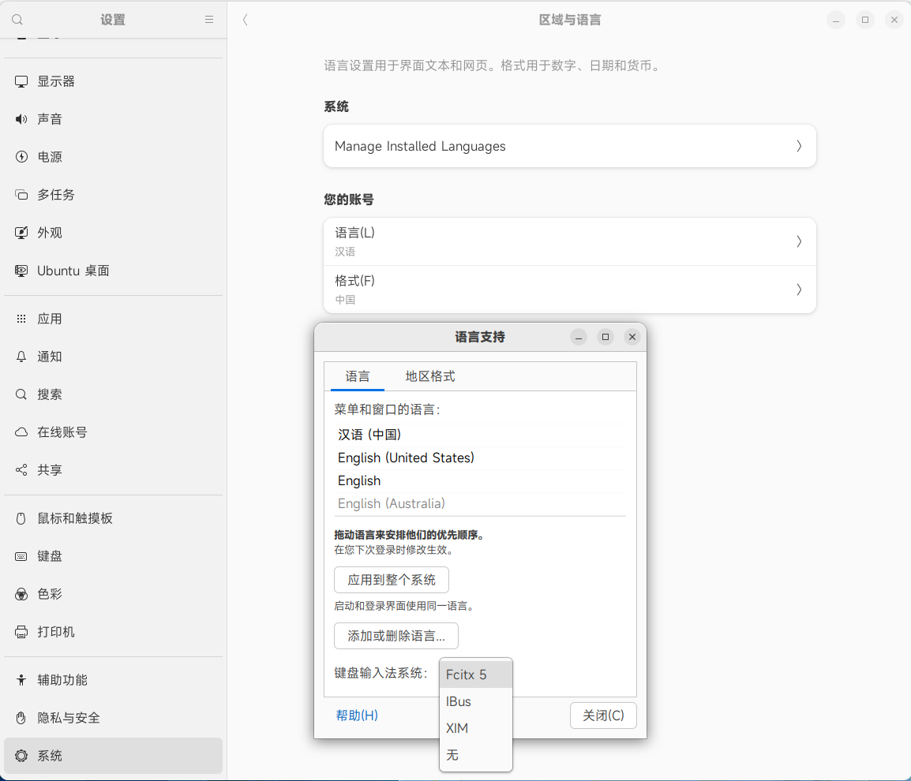
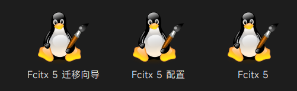
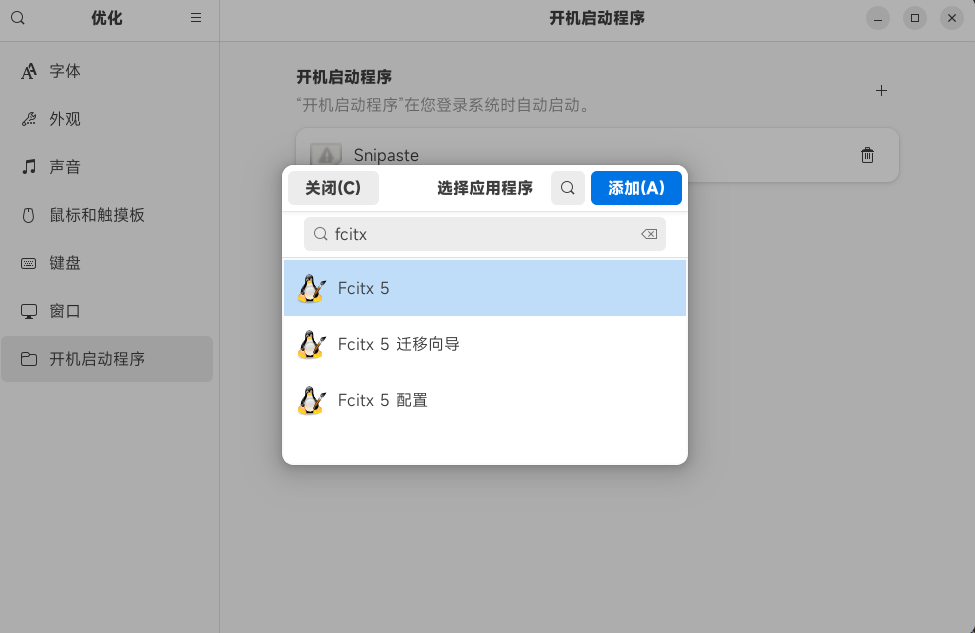
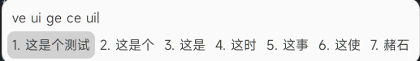
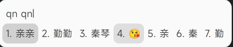

# 安装 fcitx5

## 1. 安装程序本体

我使用的是 ubuntu, 所以里面的包管理工具为 apt 系列的。

```shell
sudo apt install fcitx5 fcitx5-chinese-addons fcitx5-chinese-addons-bin fcitx5-chinese-addons-data fcitx5-table-emoji fcitx5-pinyin-gui fcitx5-pinyin fcitx5-data
```

好像里面最重要是的 `fcitx5` `fcitx5-chinese-addons` `fcitx5-pinyin` ，装了之后才有汉语拼音。

## 2. 切换设置内容

另外 Ubuntu 默认的是使用 IBus 输入法， 还是得需要去切换输入法的设置。

具体位置是 `设置` -> `系统` -> `区域与语言` -> `manage installed language`， 如下如所示。



完事之后最好再重新启动一下，当然，貌似不重新启动也没啥问题。

在桌面就能看到这个了，三个图标， 当然 linux 怎么可能让你这么简单就弄好？ 😃 

你还需要启动一个自动启动开机项， 不然你可自己开机的时候看着他自己变成英文了，心想： 我到底弄了个啥？



## 美化

在安装完之后，系统上面会提示你一个东西，叫做 kimipanel 这玩意，能让输入法更加的好看，原生的是真的丑到爆炸！

可以来到这个网址去下载这个插件。 [https://extensions.gnome.org/extension/261/kimpanel/](https://extensions.gnome.org/extension/261/kimpanel/)

具体的效果如下。 

## 添加表情包

如果想添加上表情包的话，还需要添加一个东西。

```shell
sudo apt install fonts-noto-color-emoji
```

效果如下



最后，大功告成！！！！！！
