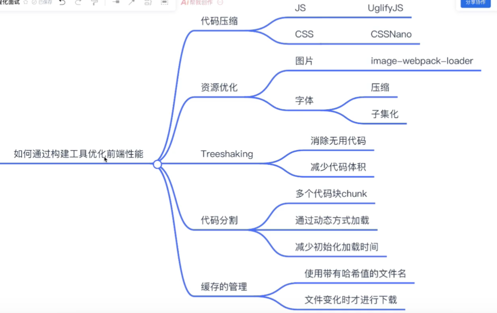

# 提升前端构建工具性能

> 来源地址: https://www.bilibili.com/video/BV1Vu4y1C73B
> 

## 提升性能可以从几方面来看 .

1.  代码压缩

压缩 `js` `css` 文件以此减少代码的体积

2.  资源优化

类似于图片 字体 视频 音乐 之类的静态资源进行特定的处理.
小的图片可以采用 `base64` 减少网络请求传输. 字体用 `font-spider` 进行压缩 .
CDN处理媒体资源什么的

3.  tree-shaking

代码 `tree-shaking` 减少无用的代码占用 . 貌似 css 代码也可以使用 purgeCSS 来进行处理

4.  代码分割

分割出非首屏的代码 , 分成小包 ,优先加载 . 加快首屏的展示速度

5.  缓存

文件采用哈希命名 , 只更新那些需要变动的文件

## 总结

现在大抵已经了解了 . 优化前端性能需要几个层面的

1. 从开发时的代码来说. 在合适的时候使用异步. 减少线程阻塞的时间. 就拿熟悉的 `Vue` 来说. `Vue` 在 `router` 中使用 `import` 来动态加载
   可以看见的组件. `Vue` 中也有异步组件 `defineAsyncComponent()` 可以极高提升代码速度. 还有就是变量的问题, `ref` 还是普通常量应该有目的的使用
   减少 `ref` 函数的使用 也能小幅度提高相应速度.
2. 应该还有像减少 `SPA` 页面, 转而使用使用 `SSR` 加速首屏的优化. (不过此方法一个页面加载一次, 体验不是很好. 或许是我 没使用 `SSR` 的问题? 为什么 `vitepress` 会分割出多个界面来展示, 貌似他也是用的 `SSR` 技术)
3. 构建工具, 正如上面所说的 `代码压缩` `资源优化` `tree-shaking` `代码分割` `哈希缓存更细`
4. 网络方面来说. 套用 `CDN` 让离用户最近的地方分发资源.
5. 加钱居士 . 弄个好的服务器, 减少多人下使用的负载.
