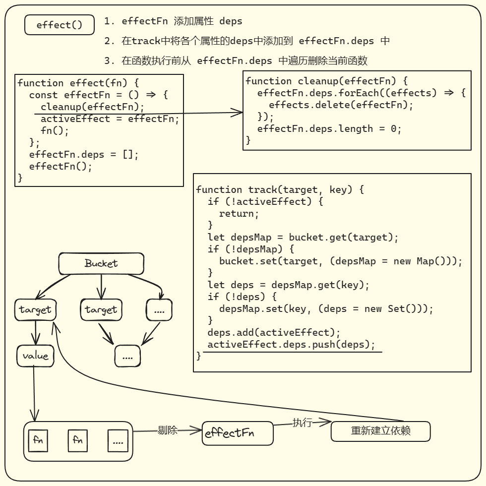

# 4.4 分支切换和 cleanup

## 问题

之前的简单的响应式系统有个小问题

类似于这种三元表达式 `objProxy.ok ? objProxy.text: "not set"`

当objProxy.ok的值始终为 true 时，text 的依赖始终有效。反之，text的依赖就失效了，遗留下无用的副作用函数。而且当 objProxy.text 变动时，还会引起表达式执行，但是没有任何的作用（表达式在 effect 执行函数中）

所以说分支切换产生了遗留的副作用函数。

## 解决方案

cleanup 是函数执行前 在 bucket 桶中清除当前副作用函数，待函数重新执行时重新收集依赖，处理无用的副作用函数

如下图

