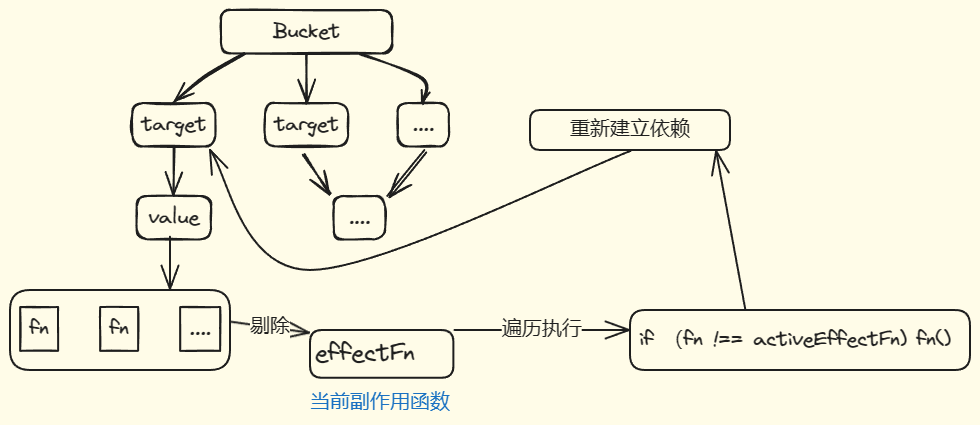

# 4.6 避免无限递归循环
在执行以下代码时：会产生无限循环的情况

```javascript
effect(() => {
  objProxy.ok = !objProxy.ok;
});
```

由于在赋值的过程中原函数还并未结束，但是触发了函数内部的重新赋值，

原函数未结束然后开始了响应式函数的执行，重新开始的响应式函数也是如此，重新赋值，执行。

所以在 trigger 中要添加限制，执行的函数与响应式的函数要是一样的跳过执行。

具体流程如下



## 代码实现

在trigger 中添加代码
```typescript
function trigger(){
//   other code.
  new Set(effects).forEach(effect => {
    // avoid maximum call stack size exceeded  // [!code ++]
    if (effect !== activeEffect){  // [!code ++]
      effect(); // [!code ++]
    }
  })
}
```