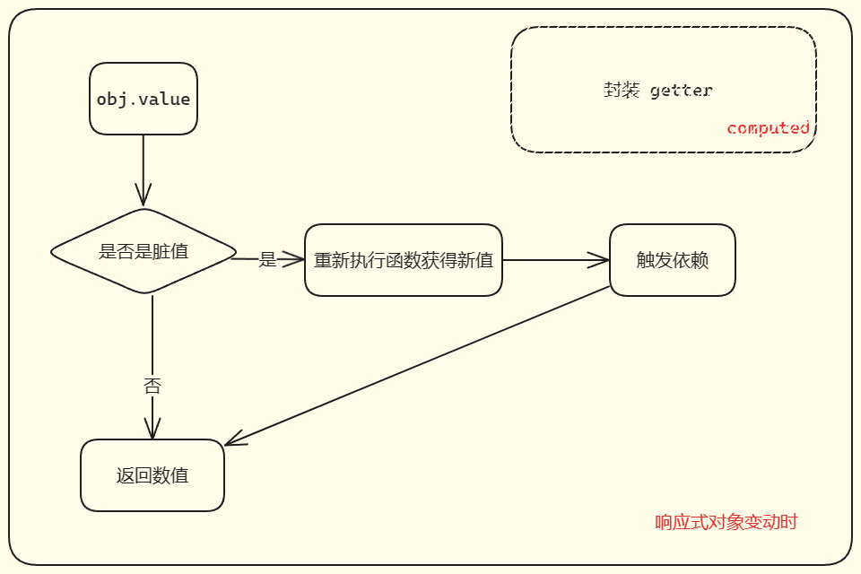

# computed and lazy

**懒执行(lazy)**：当想要函数不立即执行，控制执行的时间，在需要的时候执行。与前方的 **调度执行** 有些许区别，请仔细分辨。

**计算属性 (computer)** : 缓存数据。在响应式属性变动之后，在有需要的地方重新更新数据。

这个在需要的地方更新很有意思，在变动之后，不会像之前那种，立即执行渲染变量的值，而是等到**下一次取值**的时候，才更新渲染变量的值。

computed 实现过程： 内部嵌套一个effect函数。检测数据是否变动，数据变动后在下次取值时重新执行函数，获取新的数值并加以缓存。

## 执行流程




## 实现
<<< ./code/computed.ts {3,6-37 typescript}

这种有些许的 bug，在这种情况下，想实现在响应式变量变动之后重新执行 computed 的getter 

```typescript
const obj = computed(() => objProxy.ok)

// 特殊的 effect 嵌套
effect(() => {
  console.log(obj.value);
})

objProxy.ok = false
```

很明显是办不到，因为 value 的依赖并未收集。无法触发响应式副作用的函数重新更改，因此要手动触发

```typescript
function computed(getter:()=>any) {
  let value : any
  let dirty : boolean = true;
  const effectFn = effect(getter,
    {
      lazy: true,
      scheduler() {
        trigger(obj, value) // [!code ++]
        // 副作用函数重新执行后dirty值变脏
        dirty = true;
      }
    })
  const obj = {
    get value() {
      if (dirty) {
        // 重新获取值，dirty取消脏值
        dirty = false
        value = effectFn();
        track(obj, value) // [!code ++]
      }
      return value;
    }
  };
  return obj;
}
```

除了上面的代码更改外，effect 也要有些许的更改，毕竟懒执行需要把 effectFn 返回出去，而且computed 需要把执行的结果拿到手，所以 effectFn

的要取得执行结果，也要返回出去。 具体更改如下所示

```typescript
function effect(fn, options = { lazy: false }) {
  const effectFn = () => {}
  effectFn.options = options;
  effectFn.deps = [];
  // 懒执行返回副作用函数，其他直接执行函数
  if (!options.lazy) {  // [!code ++]
    effectFn()
  } // [!code ++]
  return effectFn;  // [!code ++]
}
```
```typescript
const effectFn = () => {
  // ...
    return res; // [!code ++]
};
```