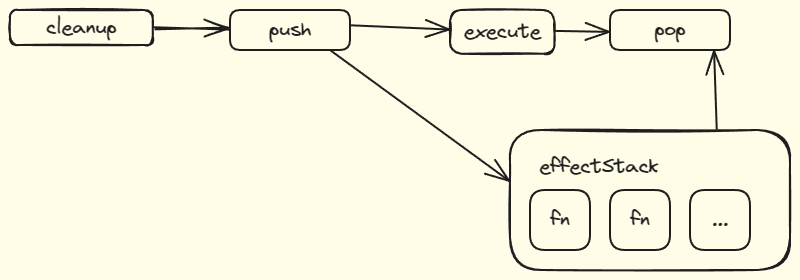

# 4.5 嵌套的 effect 函数

在执行 activeEffect 会被嵌套执行的 effect 函数覆盖

比如以下代码

```javascript
effect(function () {
  console.log("this is effecfFn1.");
  effect(function () {
    console.log("this is effectFn2.");
    let tmp2 = objProxy.ok;
  });
  let tmp = objProxy.ok;
});
```

当更改 objProxy.ok 时，由于副作用函数重新执行，结果就是

``` log
this is effecfFn1
this is effecfFn1
this is effecfFn2
```

当执行内部 effectFn 时， 内部的响应式对象建立连接，导致外部的 effectFn 赋值的 activeEffect 被覆盖

所以需要将加入一个 effectStack 解决问题

```javascript
function effect(fn) {
  const effectFn = () => {
    cleanup(effectFn);
    activeEffect = effectFn;
    effectStack.push(activeEffect);
    fn();
    effectStack.pop();
    activeEffect = effectStack[effectStack.length - 1];
  };
  effectFn.deps = [];
  effectFn();
}
```

## 函数内部执行过程图示

