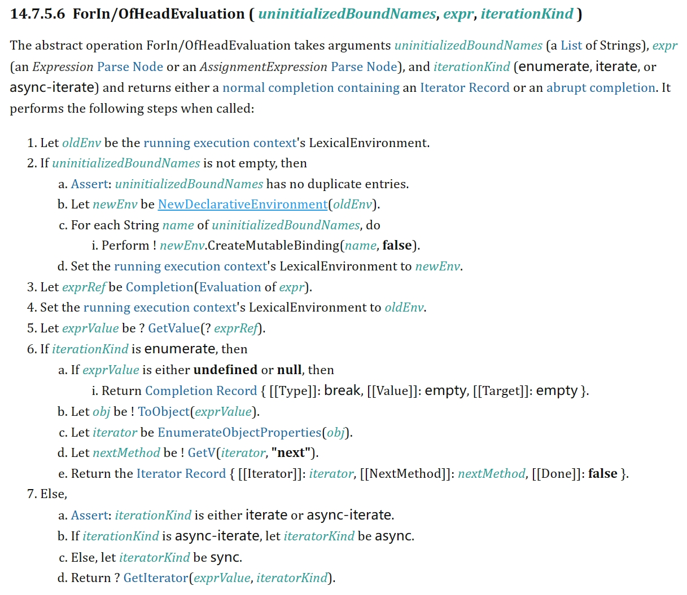
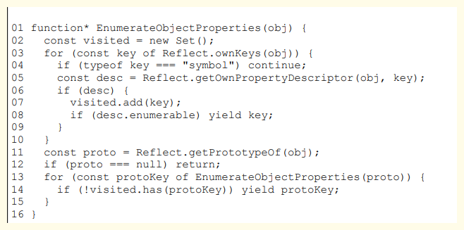
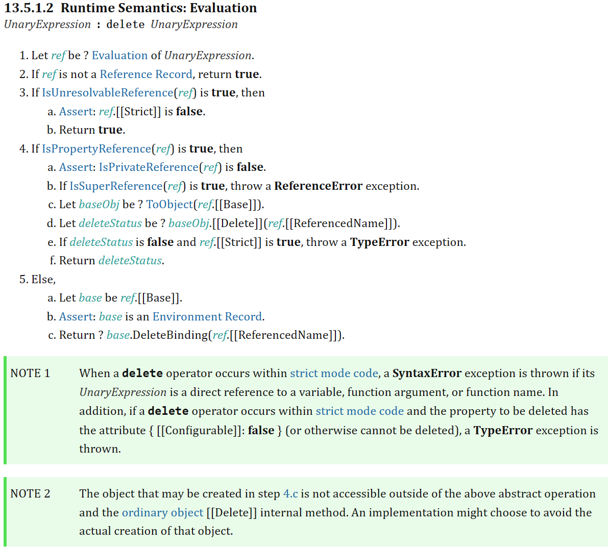

# 代理对象

## 5.3-1 in 关键字

由于前面以及把相关的实现了。 但是在某些关键字操作中会有读取属性的关键字。 例如 in , for ... in

```typescript
const obj = { foo: "foo" };
"foo" in obj; // 返回true
```

上面常规的操作可是无法捕捉到这个操作的，所以要实现访问代理的这个关键字。

根据 [ecma262 的官方文档 ](https://262.ecma-international.org/14.0/) ，可以了解到， in 关键字由以下步骤实现。

```text
RelationalExpression : RelationalExpression in ShiftExpression
1. Let lref be ? Evaluation of RelationalExpression.
2. Let lval be ? GetValue(lref).
3. Let rref be ? Evaluation of ShiftExpression.
4. Let rval be ? GetValue(rref).
5. If rval is not an Object, throw a TypeError exception.
6. Return ? HasProperty(rval, ? ToPropertyKey(lval)).
```

在第六步骤中，看到他返回一个 hasProperty(), 在对象中 hasProperty 对应的是has内部方法，因此可以在Proxy 对象中拦截 has 的handler。

具体代码如下

```typescript
import { track } from "@vue/reactivity";

function reactivity(obj: unknown) {
  return new Proxy(obj, {
    has(
      target: unknown,
      p: string | symbol,
      newValue: any,
      receiver: any
    ) {
      // [!code ++]
      track(target, p); // [!code ++]
      // return Reflect.has(...args) // [!code ++]
      return Reflect.has(target, key, receiver); // [!code ++]
    } // [!code ++]
  });
}
```

## 5.3-2 for... in 关键字

在普通 handler 中依旧无法清晰找到与之相关联的拦截操作，还是需要查询文档。

文档中如图所示



仔细观察第 6 步的第 c 子步骤：

让 `iterator` 的值为 `? EnumerateObjectProperties(obj)` 。 其中的关键点在于 `EnumerateObjectProperties(obj)` 。这里的 `EnumerateObjectProperties` 是一个抽象方法，该方法返回一个迭代器对象，规范的 14.7.5.9 节给出了满足该抽象方法的示例实现，如下面的代码所示：



可以看到，该方法是一个 `generator` 函数，接收一个参数obj。实际上，obj 就是被 `for...in` 循环遍历的对象，其关键点在于使用 `Reflect.ownKeys(obj)` 来获取只属于对象自身拥有的键。有了这个线索，如何拦截 `for...in` 循环的答案已经很明显了，我们可以使用 `ownKeys` 拦截函数来拦截 `Reflect.ownKeys` 操作：

```typescript
import { ITERATE_KEY, track } from "@vue/reactivity";

function reactivity(obj: unknown) {
  return new Proxy(obj, {
    ownKeys(
      target: unknown,
      p: string | symbol,
      newValue: any,
      receiver: any
    ) {
      // [!code ++]
      track(target, ITERATE_KEY); // [!code ++]
      return Reflect.ownKeys(target); // [!code ++]
    } // [!code ++]
  });
}
```

虽然现在已经完成了 `for ... in` 的收集，但是当对象增加或者删除会影响列表属性的多少。 而且在这里并无法触及副作用函数的重新触发，所以这又是一个问题。

像 `const obj = reactive({foo:'foo'}, handler)`。 通过 `obj.foo = 'foo2'`， 执行后可以看到副作用函数无法触发。

### 解决方法

找一个不变动的属性名，然后把 for ... in 循环添加到副作用函数里。待执行的时候检查是否需要执行 for ... in 循环里的副作用函数。

由于是增加属性，大体内容需要在 setHandler 里实现。

```typescript
import { track, trigger } from "@vue/reactivity";

enum triggerType {
  add = "ADD",
  update = "UPDATE"
}

function trigger(target: unknown, key: unknown, type: triggerType) {
  // [!code ++]
  // ...
  const effects = depsMap.get(key);
  const iterateEffects = depsMap.get(ITERATE_KEY); // [!code ++]
  //  ......
  // 因为增加和删除都会影响对象的长度和 for 循环的次数，要重新执行一遍副作用函数
  if (type === triggerType.add) {
    // [!code ++]
    iterateEffects && // [!code ++]
      iterateEffects.forEach(effect => {
        // [!code ++]
        effectsToRun.add(effect); // [!code ++]
      }); // [!code ++]
  } // [!code ++]

  effectsToRun.forEach(effect => {
    // avoid maximum call stack size exceeded
    if (activeEffect !== effect) {
      if (effect.options.scheduler) {
        return effect.options.scheduler(effect);
      } else {
        effect();
      }
    }
  });
}

function reactivity(obj: unknown) {
  return new Proxy(obj, {
    has(
      target: unknown,
      p: string | symbol,
      newValue: any,
      receiver: any
    ) {
      track(target, p);
      return Reflect.has(target, key, receiver);
    },
    ownKeys(
      target: unknown,
      p: string | symbol,
      newValue: any,
      receiver: any
    ) {
      track(target, ITERATE_KEY);
      return Reflect.ownKeys(target);
    },
    set(
      target: unknown,
      p: string | symbol,
      newValue: any,
      receiver: any
    ): boolean {
      const type = Object.prototype.hasOwnProperty.call(target, p) // [!code ++]
        ? triggerType.update
        : triggerType.add; // [!code ++]
      const result = Reflect.set(target, p, newValue, receiver);
      trigger(target, p, type); // [!code ++]
      return result;
    }
  });
}
```

## 5.3-3 delete 操作符

使用 delete 操作符删除属性时， 也无法触发副作用函数。 查询文档， 发现 delete 操作符的实现如下：



由第 5 步 d 子步骤可知，delete 操作符的行为依赖 `[[Delete]]` 内部方法。接着查看表 5-3 可知，该内部方法可以使用 deleteProperty 拦截,

```typescript
import { ITERATE_KEY, track, trigger } from "@vue/reactivity";

enum triggerType {
  add = "ADD",
  update = "UPDATE",
  delete = "DELETE"
}

function reactivity(obj: unknown) {
  return new Proxy(obj, {
    deleteProperty(target: unknown, p: string | symbol): boolean {
      const hasKey = Object.prototype.hasOwnProperty.call(target, p);
      const res = Reflect.deleteProperty(target, p);
      if (res && hasKey) {
        trigger(target, p, triggerType.delete);
      }
      return res;
    }
  });
}
```

相对应的，在trigger中也要加入相关的类型检查

```typescript
function trigger(target: unknown, key: unknown, type: triggerType) {
  // [!code ++]
  // ...
  // 因为增加和删除都会影响对象的长度和 for 循环的次数，要重新执行一遍副作用函数
  if (type === triggerType.add || type === triggerType.delete) {
    // [!code ++]
  }
  // ....
}
```
