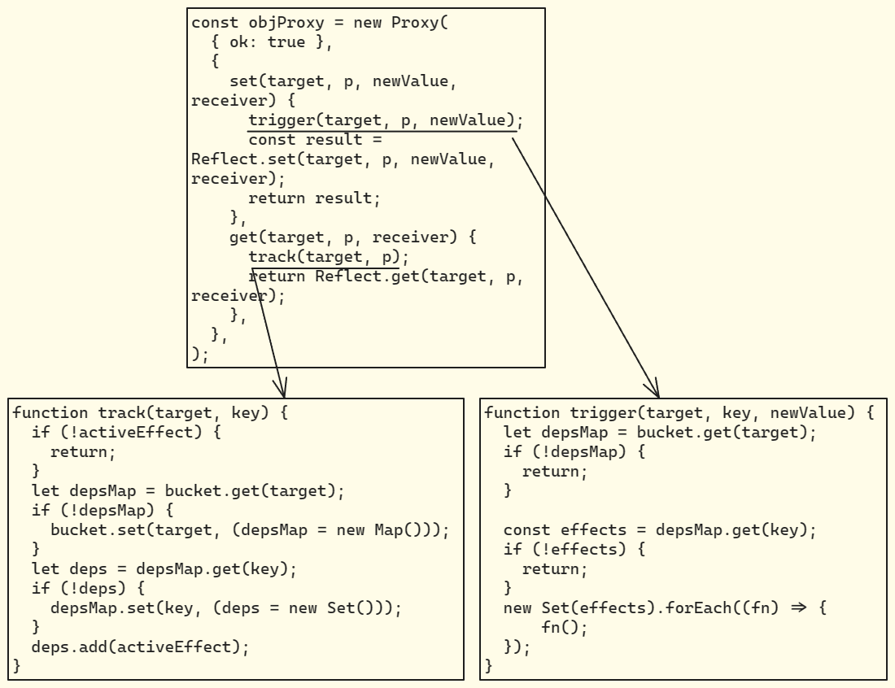
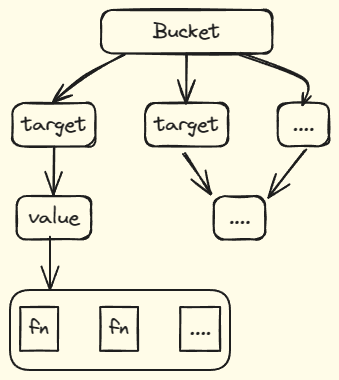

## 4.3 什么是响应式系统

响应式系统是 Vue.js 框架的核心概念，它提供了一种响应式的数据绑定机制，使得数据的变化能够自动更新到视图上。

在Vue设计与实现中，一个简单的响应式系统代码大体的过程如下



effect 函数的作用：

促进函数的执行，在函数执行的过程中碰到 Proxy 代理过的对象，然后对象与函数绑定

```typescript
type effect = () => any;
```

由于响应式变量变动引发函数重加载，所以要关联响应式变量到相对应的函数，大体结构如这个图所示 

当响应式变量变动，从bucket中读取到与之相关联的函数， 然后执行函数。

这便是一个简单但是完整一些的响应式系统
