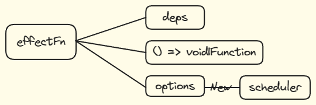

# 4.7 调度执行

当想要代码出发副作用函数时想要决定副作用执行的时机、次数以及方式，就要借助调度执行

由于是在执行期间调用，所以要添加属性 effectFn.options.scheduler

借助 effectFn.options.scheduler 来 hook 函数执行的时间

于是乎， effectFn 的结构样子变成了 

代码如下

<<< ./code/scheduler.ts{3,7-9,15,25,27 typescript}
