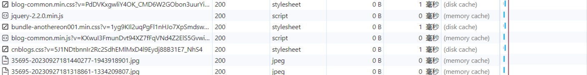
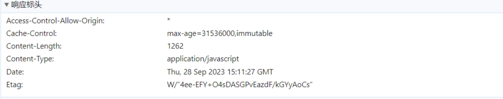
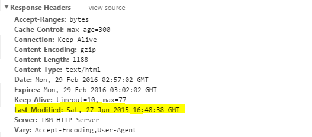
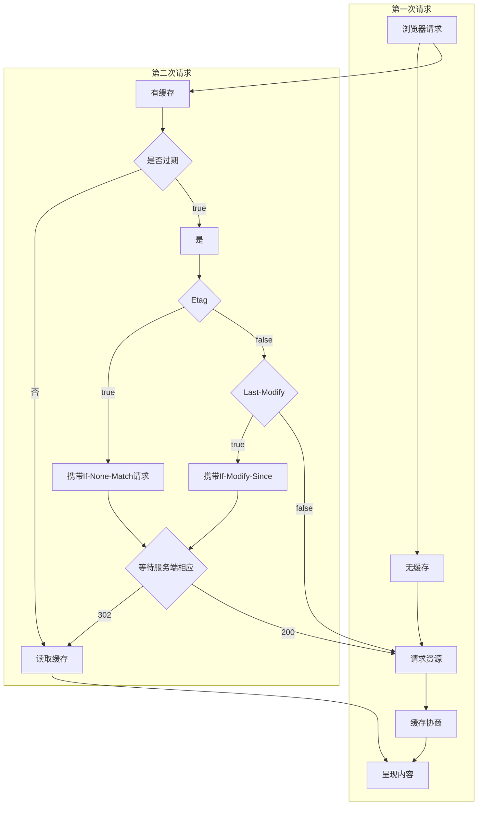

# 浏览器缓存

> reference: https://www.cnblogs.com/ranyonsue/p/8918908.html

Web 缓存大致可以分为：数据库缓存、服务器端缓存（代理服务器缓存、CDN 缓存）、浏览器缓存。

浏览器缓存也包含很多内容： HTTP 缓存、indexDB、cookie、localstorage 等等。这里我们只讨论 HTTP 缓存相关内容。

在具体了解 HTTP 缓存之前先来明确几个术语：

- 缓存命中率：从缓存中得到数据的请求数与所有请求数的比率。理想状态是越高越好。
- 过期内容：超过设置的有效时间，被标记为“陈旧”的内容。通常过期内容不能用于回复客户端的请求，必须重新向源服务器请求新的内容或者验证缓存的内容是否仍然准备。
- 验证：验证缓存中的过期内容是否仍然有效，验证通过的话刷新过期时间。
- 失效：失效就是把内容从缓存中移除。当内容发生改变时就必须移除失效的内容。

浏览器缓存主要是 HTTP 协议定义的缓存机制。HTML meta 标签，例如

```html-vue
<META HTTP-EQUIV="Pragma" CONTENT="no-store">
```

含义是让浏览器不缓存当前页面。<b>但是代理服务器不解析</b> HTML 内容，一般应用广泛的是<b>用 HTTP 头信息控制缓存</b>。

## 浏览器缓存分类

浏览器缓存分为强缓存和协商缓存，浏览器加载一个页面的简单流程如下：

1. 浏览器先根据这个资源的http头信息来判断是否命中强缓存。如果命中则直接加在缓存中的资源，并不会将请求发送到服务器。
2. 如果未命中强缓存，则浏览器会将资源加载请求发送到服务器。服务器来判断浏览器本地缓存是否失效。若可以使用，则服务器并不会返回资源信息，浏览器继续从缓存加载资源。
3. 如果未命中协商缓存，则服务器会将完整的资源返回给浏览器，浏览器加载新资源，并更新缓存。

## 强缓存

命中强缓存时，浏览器并不会将请求发送给服务器。在Chrome的开发者工具中看到http的返回码是200，但是在Size列会显示为(from cache)。 

### Expires

缓存过期时间，用来指定资源到期的时间，是服务器端的具体的时间点。也就是说，`Expires=max-age + 请求时间`，需要和`Last-modified` 结合使用。 Expires是Web服务器响应消息头字段，在响应http请求时告诉浏览器在过期时间前浏览器可以直接从浏览器缓存取数据，而无需再次请求。

该字段会返回一个时间，比如Expires:Thu,31 Dec 2037 23:59:59 GMT。这个时间代表着这个资源的失效时间，也就是说在2037年12月31日23点59分59秒之前都是有效的，即命中缓存。这种方式有一个明显的缺点，由于失效时间是一个绝对时间，所以当客户端本地时间被修改以后，服务器与客户端时间偏差变大以后，就会导致缓存混乱。于是发展出了Cache-Control。


### cache-control

Cache-Control是一个相对时间，例如Cache-Control:3600，代表着资源的有效期是3600秒。由于是相对时间，并且都是与客户端时间比较，所以服务器与客户端时间偏差也不会导致问题。

Cache-Control与Expires可以在服务端配置同时启用或者启用任意一个，<b> 同时启用的时候Cache-Control优先级高 </b>。

 Cache-Control 可以由多个字段组合而成，主要有以下几个取值：

1. `max-age` 指定一个时间长度，在这个时间段内缓存是有效的，单位是s。例如设置 Cache-Control: max-age=31536000，也就是说缓存有效期为（31536000 / 24 / 60 \* 60）天，第一次访问这个资源的时候，服务器端也返回了 Expires 字段，并且过期时间是一年后。 在没有禁用缓存并且没有超过有效时间的情况下，再次访问这个资源就命中了缓存，不会向服务器请求资源而是直接从浏览器缓存中取。
2. `s-maxage` 同 max-age，覆盖 max-age、Expires，但仅适用于共享缓存，在私有缓存中被忽略。
3. `public` 表明响应可以被任何对象（发送请求的客户端、代理服务器等等）缓存。
4. `private` 响应只能单个用户（可能是操作系统用户、浏览器用户）缓存，是非共享的，不能被代理服务器缓存。
5. `no-cache` 强制所有缓存了该响应的用户，在使用已缓存的数据前，发送带验证器的请求到服务器。不是字面意思上的不缓存。
6. `no-store` 禁止缓存，每次请求都要向服务器重新获取数据。
7. `must-revalidate`指定如果页面是过期的，则去服务器进行获取。这个指令并不常用，就不做过多的讨论了。

## 协商缓存

若未命中强缓存，则浏览器会将请求发送至服务器。服务器根据http头信息中的 `Last-Modify/If-Modify-Since` 或 `Etag/If-None-Match` 来判断是否命中协商缓存。如果命中，则http返回码为304，浏览器从缓存中加载资源。

### Last-Modify/If-Modify-Since

 浏览器第一次请求一个资源的时候，服务器返回的header中会加上Last-Modify，Last-modify是一个时间标识该资源的最后修改时间，例如Last-Modify: Thu,31 Dec 2037 23:59:59 GMT。

当浏览器再次请求该资源时，发送的请求头中会包含 `If-Modify-Since` ，该值为缓存之前返回的 `Last-Modify` 。服务器收到 `If-Modify-Since` 后，根据资源的最后修改时间判断是否命中缓存。

如果命中缓存，则返回http304，并且不会返回资源内容，并且不会返回 `Last-Modify` 。由于对比的服务端时间，所以客户端与服务端时间差距不会导致问题。但是有时候通过最后修改时间来判断资源是否修改还是不太准确（资源变化了最后修改时间也可以一致）。于是出现了 `ETag/If-None-Match`。

### ETag/If-None-Match

 与Last-Modify/If-Modify-Since不同的是，Etag/If-None-Match返回的是一个校验码（ETag: entity tag）。ETag可以保证每一个资源是唯一的，资源变化都会导致ETag变化\*。ETag值的变更则说明资源状态已经被修改。服务器根据浏览器上发送的If-None-Match值来判断是否命中缓存。

### ETag扩展说明

我们对ETag寄予厚望，希望它对于每一个url生成唯一的值，资源变化时ETag也发生变化。神秘的Etag是如何生成的呢？以Apache为例，ETag生成靠以下几种因子

- 文件的i-node编号，此i-node非彼iNode。是Linux/Unix用来识别文件的编号。是的，识别文件用的不是文件名。使用命令’ls –I’可以看到。
- 文件最后修改时间
- 文件大小

生成Etag的时候，可以使用其中一种或几种因子，使用抗碰撞散列函数来生成。所以，理论上ETag也是会重复的，只是概率可以忽略。

## 既生Last-Modified何生Etag？

你可能会觉得使用Last-Modified已经足以让浏览器知道本地的缓存副本是否足够新，为什么还需要Etag（实体标识）呢？HTTP1.1中Etag的出现主要是为了解决几个Last-Modified比较难解决的问题：

1. Last-Modified标注的最后修改只能精确到秒级，如果某些文件在1秒钟以内，被修改多次的话，它将不能准确标注文件的修改时间

2. 如果某些文件会被定期生成，当有时内容并没有任何变化，但Last-Modified却改变了，导致文件没法使用缓存

3. 有可能存在服务器没有准确获取文件修改时间，或者与代理服务器时间不一致等情形

Etag是服务器自动生成或者由开发者生成的对应资源在服务器端的唯一标识符，能够更加准确的控制缓存。`Last-Modified` 与 `ETag` 是可以一起使用的，服务器会优先验证ETag，一致的情况下，才会继续比对Last-Modified，最后才决定是否返回304。

## 用户行为与缓存

浏览器缓存行为还有用户的行为有关！！！

|   用户操作   | Expires/Cache-Control | Last-Modified/Etag |
| :----------: | :-------------------: | :----------------: |
|  地址栏回车  |         有效          |        有效        |
| 页面链接跳转 |         有效          |        有效        |
|   新开窗口   |         有效          |        有效        |
|  前进、后退  |         有效          |        有效        |
|    F5刷新    |         无效          |        有效        |
| Ctrl+F5刷新  |         无效          |        无效        |

## 总结:


