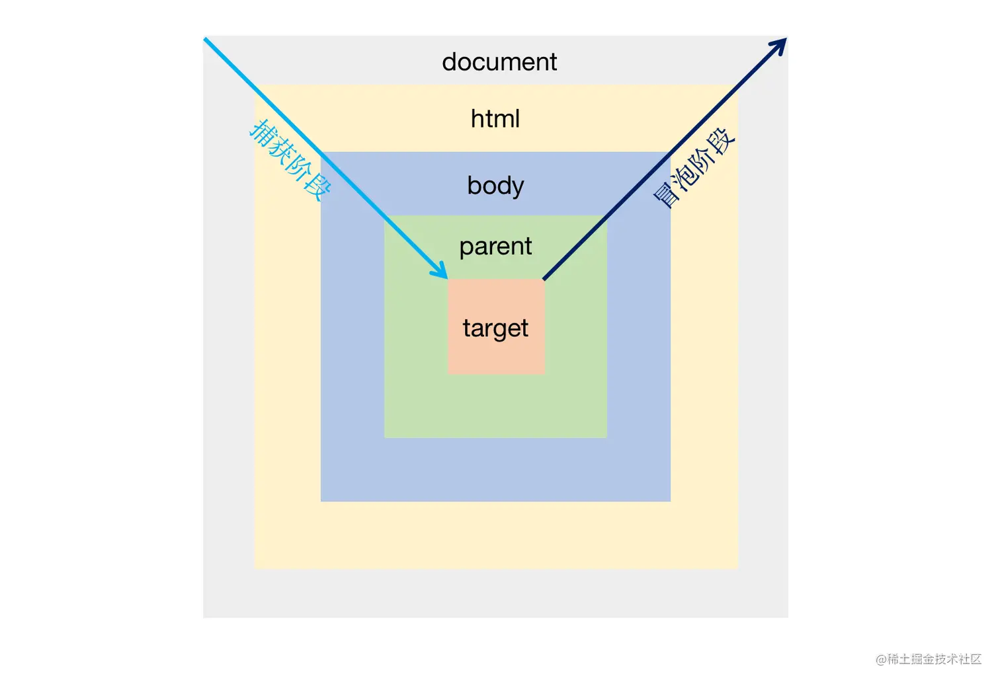

# 事件委托/事件代理

## 事件传播

一个事件触发后，会在子元素和父元素之间传播（propagation）。这种传播分成三个阶段。

1. 捕获阶段：从window对象传导到目标节点（上层传到底层）称为“捕获阶段”（capture phase），捕获阶段不会响应任何事件；
2. 目标阶段：在目标节点上触发，称为“目标阶段”
3. 冒泡阶段：从目标节点传导回window对象（从底层传回上层），称为“冒泡阶段”（bubbling phase）。事件代理即是利用事件冒泡的机制把里层所需要响应的事件绑定到外层。

具体的过程如下图所示 

## 为什么使用事件委托/事件代理

使用事件代理之前为每个 li 添加 click 事件的方式：

```html
<ul>
  <li>1</li>
  <li>2</li>
  <li>3</li>
  <li>4</li>
</ul>
```


```js
// 获取所有的li
const ul = document.querySelector('ul');
// 挨个绑定事
li const lis = document.querySelectorAll('li'); 件 lis.forEach(li => {
    li.addEventListener('click',function (event){         alert(`${this.innerText}被点击了`);
   });
});
```

我们需要获取所有的 li ，然后为其所有元素添加事件。这有两个缺点：

- 新添加的 li 标签需要再次为其绑定事件

```js
// 点击5不会触发事件`
let newLi = document.createElement("li");
newLi.innerText = "5";
ul.appendChild(newLi);
```

- 每一个 li 标签都需单独绑定事件

当我们使用事件代理的思路来为其添加事件处理函数时：

```js
// 事件绑定到其公共的祖先元素ul上
const ul = document.querySelector("ul");
// 这里this是ul，event.target 才是li
ul.addEventListener("click", function (event) {
  alert(`${event.target.innerText}被点击了`);
});
let newLi = document.createElement("li");
newLi.innerText = "5";
ul.appendChild(newLi);
```

现在还有一个问题：当点击 ul 中其他元素时也会触发事件，但我们只想在点击 ul 下的第一层 li 标签才触发事件，其他标签被点击不触发。

可以通过判断 event.target 的标签类型来判断被点击的是不是 li 标签，然后判断其父元素是否是 ul 来判断其是不是 ul 下的第一层 li 标签。

```js
<ul>
     <li>1</li>
     <li>2</li>
     <li>3</li>
     <li><div>4</div></li>
     <span>5</span>
     <div>6</div>
</ul>

<script>
     const ul = document.querySelector('ul');
         ul.addEventListener('click', function (event){
         // 标签为li标签 而且 父元素为ul
    const target = event.target
    if(target.tagName === 'LI' && target.parentNode === this){
        alert(`${target.innerText}被点击了`);
    }
});
</script>
```

现在我们解决了刚刚的问题，但是又遇到一个新的问题就是当我们点击 4 时不会触发事件，原因是 4 包裹在一个 div 标签中，所以本次事件的 target 的 div 而不是 li。但是按理我们同样需要处理点击 li 的事件处理函数（因为冒泡机制）

我们可以通过获取 target 的祖先节点，如果我们需要被代理事件的 li 为其祖先节点，则表示我们需要执行处理函数

```js
const ul = document.querySelector("ul");
ul.addEventListener("click", function (event) {
  // 获取到被点击节点的祖先节点，直到其父节点为ul
  let target = event.target;
  while (target && target.parentNode !== this) {
    target = target.parentNode;
  }
  if (target.tagName === "LI" && target.parentNode === this) {
    alert(`${target.innerText}被点击了`);
  }
});
```

这样一个简单版的事件代理就实现了，他有什么好处：

- 只需要绑定一个事件到ul上，占用的内存更小
- 可以为动态添加的元素监听事件，不需要每添加一个元素就重新绑定一次。

## 事件委托

事件委托是一个叫法，例如上面的例子，ul 为 li 代理 click 事件，这就叫做事件代理。也可以说是 li 将 click 事件委托给 ul，这就叫做事件委托。

所以当面试官问你事件委托和事件代理的区别，千万不要蒙了，这俩其实是一个东西。
