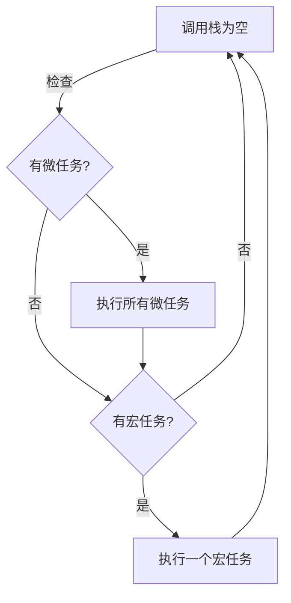
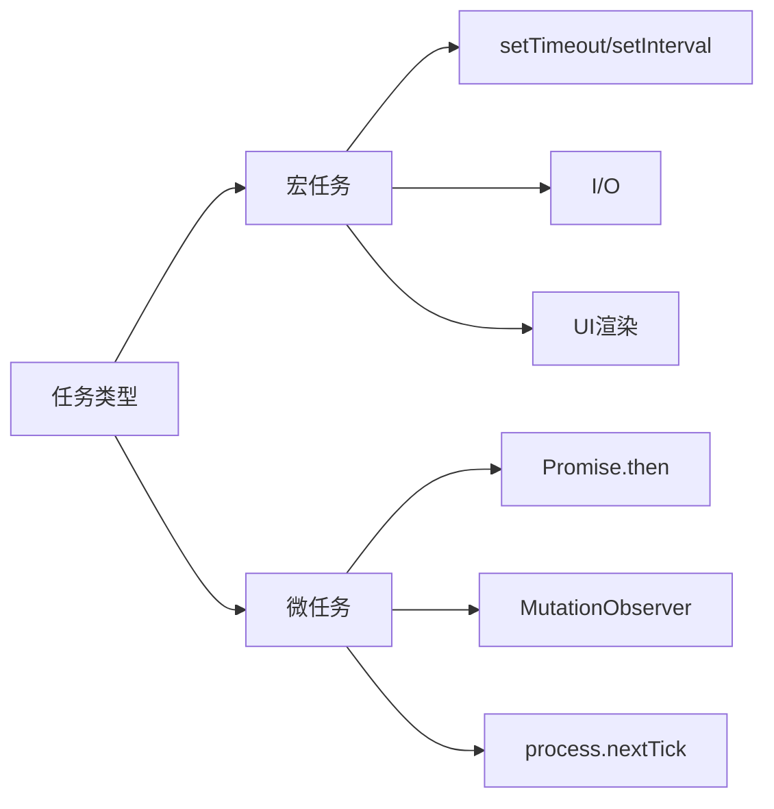
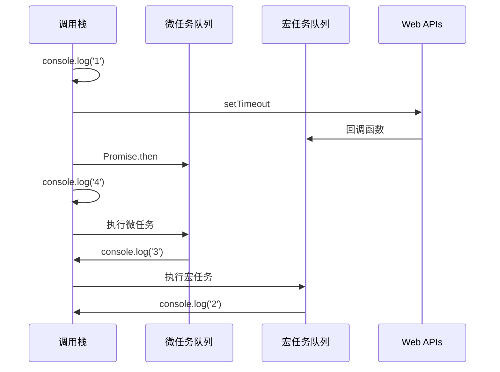

# JavaScript Event Loop

JavaScript 的事件循环是其实现异步编程的核心机制。它使得 JavaScript 能够在单线程环境下处理多个并发操作。

## 基本概念

JavaScript 运行时包含以下几个重要组件：

1. **调用栈（Call Stack）**：执行同步代码的地方
2. **堆（Heap）**：存储对象的内存空间
3. **任务队列（Task Queue）**：
   - 宏任务（Macrotask）队列
   - 微任务（Microtask）队列
4. **Web APIs**：提供异步操作的接口（在浏览器环境中）

## 事件循环的工作流程



## 详细执行过程

1. 同步代码直接在调用栈中执行
2. 异步代码交给 Web APIs 处理
3. Web APIs 完成后，回调函数被放入相应的任务队列
4. 当调用栈为空时：
   - 先清空微任务队列
   - 然后取出一个宏任务执行

## 任务类型对比



## 代码示例

尝试运行以下代码，观察事件循环的执行顺序：

默认示例：

```javascript
console.log("1"); // 同步任务

setTimeout(() => {
  console.log("2"); // 宏任务
}, 0);

Promise.resolve().then(() => {
  console.log("3"); // 微任务
});

console.log("4"); // 同步任务
```

## 执行顺序图解



## 注意事项

1. 微任务优先级高于宏任务
2. 每个宏任务之后都会清空微任务队列
3. `requestAnimationFrame` 在渲染之前执行
4. Node.js 环境下的事件循环与浏览器略有不同

## 实际应用

事件循环机制的理解对于以下场景特别重要：

- 性能优化
- 异步操作处理
- 动画效果实现
- 用户交互响应

理解事件循环有助于我们写出更高效的异步代码，避免阻塞主线程，提供更好的用户体验。
