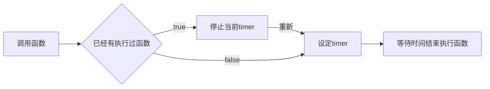
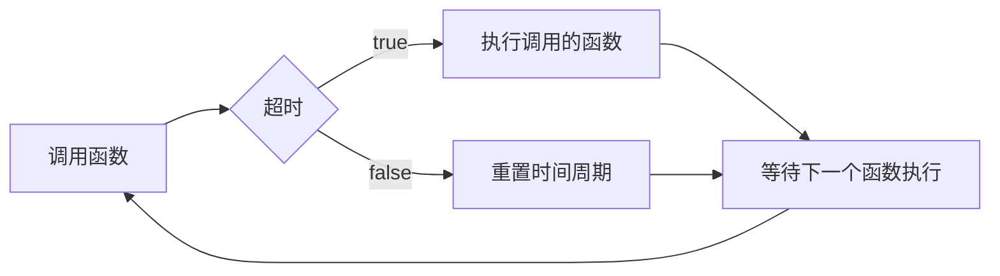
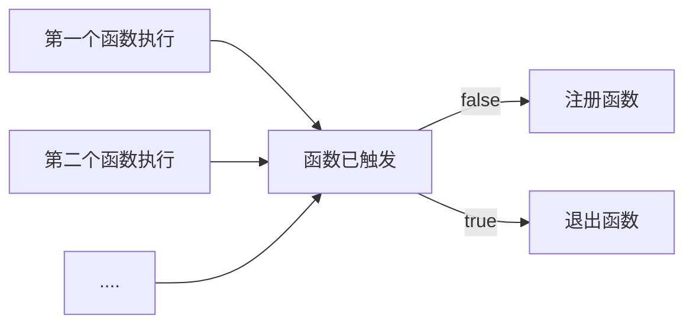
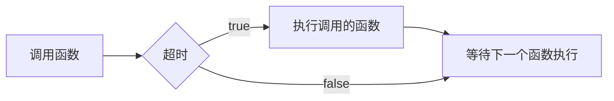

# 防抖和节流

## 防抖 Debounce

> reference: <https://juejin.cn/post/7057135245513981989>

**延迟 [`debounce`] ，是在周期结束时执行函数，周期结束后在间隔时间内又有事件触发，不执行。**

主要流程也不是太复杂，由于 js 函数 setTimeout 在执行前未执行的话能够被主动取消，这是执行的关键。

防抖其实挺简单的，就是在某个时间段内防止多次点击。防抖分为两种 `延迟debounce` 和 `前缘debounce`

`防抖`的特点是当事件快速连续不断触发时，动作只会执行一次。

延迟是在高频事件结束后触发，前缘是在高频事件开始时触发。

### 延迟 debounce

#### 流程简图



### 具体代码如下所示

<b> 这是作为外部测试的函数 </b>

```typescript
// ./log.ts
export function log(message: string) {
  return function () {
    console.log(message);
  };
}
```

**主要实现的函数**

```typescript [setTimeout实现]
// ./debounce.ts
import { log } from "./log.ts";

let timer: undefined | number = undefined;

function debounce(fn: Function, waitTime: number) {
  if (timer) {
    // 若存在正在发生的事件，清除定时重置变量
    clearTimeout(timer);
    timer = undefined;
  }
  timer = setTimeout(fn, waitTime);
}

debounce(log("debounce"), 5000);

setTimeout(() => {
  console.log(`the debounce has reset!`);
  debounce(test, 5000);
}, 3000);
```

### 前缘 debounce

前缘 debounce，即执行动作在前，然后设定周期，周期内有事件被触发，不执行动作，且周期重新设定。

#### 流程简图



具体代码

::: code-group

```typescript [setTimeout实现]
// ./debounce.ts
let timer: ITimer = undefined || null;

function debounce(fn: Function, delay: number) {
  // timer 存在, 则说明已经执行过了函数, 需要等待延迟周期结束之后可再重新执行
  if (timer) {
    // 重置 timer
    clearTimeout(timer);
    timer = setTimeout(
      () => console.log("请等待延迟周期结束之后执行"),
      delay
    );
    return;
  }
  // 未执行过函数,则直接执行函数并且注册相关内容
  timer = setTimeout(fn());
}

debounce(log("debounce1"), 5000);
debounce(log("debounce2"), 5000);

setTimeout(() => debounce(log("debounce3"), 5000), 5500);
```

```typescript [date实现]
// ./debounce.ts
type ITimer =
  | {}
  | {
      fn: null | Function;
      delay: number;
      registerTime: number;
    };

let timer: ITimer = {};

function debounce(fn: Function, delay: number) {
  // 检测是否已经有检查注册时间.
  if (Date.now() - timer.registerTime < timer.delay) {
    //   没超过有效延迟时间周期, 重新注册函数
    timer = { fn, delay, registerTime: Date.now() };
    return;
  }
  // 未执行过函数,则直接执行函数并且注册相关内容
  fn();
  timer = { fn, delay, registerTime: Date.now() };
}

debounce(log("debounce1"), 5000);
debounce(log("debounce2"), 5000);

setTimeout(() => debounce(log("debounce3"), 5000), 5500);
```

:::

## 节流 Throttle

throttle（节流），节流的策略是，固定周期内，只执行一次动作，若有新事件触发，不执行。周期结束后，又有事件触发，开始新的周期。

节流策略也分前缘和延迟两种。与 debounce 类似，延迟是指 周期结束后执行动作，前缘是指执行动作后再开始周期。

::: tip 两者的区别

**区别: 在持续的时间内重复触发函数.** **防抖时间会重置时间周期**

:::

所以, 节流只需要在 `防抖` 的基础上把重置时间周期的东西去掉即可.

### 延迟 throttle

#### 流程简图



```typescript [setTimeout实现]
// ./throttle.ts
import { log } from "./log.ts";

let timer: undefined | number = undefined;

function throttle(fn: Function, waitTime: number) {
  if (timer) {
    // 若存在正在发生的事件, 则直接退出
    return;
  }
  // 若不存在事件, 立即开始设置事件
  timer = setTimeout(() => {
    fn();
    timer = undefined;
  }, waitTime);
}

throttle(log("throttle"), 5000);

setTimeout(() => {
  console.log(`the throttle has reset!`);
  throttle(test, 5000);
}, 3000);
```

### 前缘 throttle

#### 流程简图



```typescript
// ./throttle.ts
type ITimer =
  | {}
  | {
      fn: null | Function;
      delay: number;
      registerTime: number;
    };

let timer: ITimer = {};

function throttle(fn: Function, delay: number) {
  // 检测是否已经有检查注册时间.
  if (Date.now() - timer.registerTime < timer.delay) {
    // 若存在正在发生事件, 则直接退出
    return;
  }
  // 未执行过函数,则直接执行函数并且注册相关内容
  fn();
  timer = { fn, delay, registerTime: Date.now() };
}

debounce(log("throttle1"), 5000);
debounce(log("throttle2"), 5000);

setTimeout(() => debounce(log("throttle3"), 5000), 5500);
```
